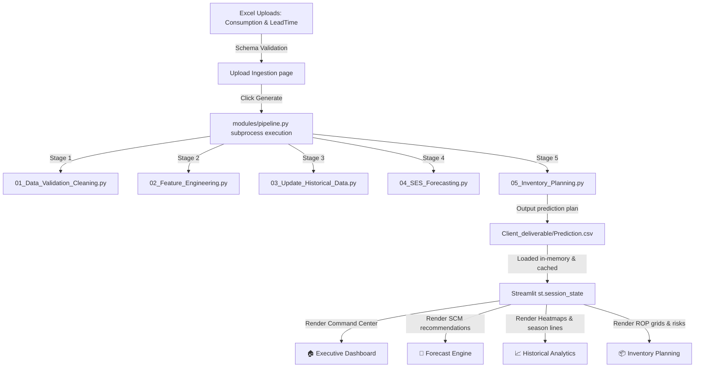

# Project Context — Enterprise Architecture & Systems Manual

This document provides a comprehensive technical overview of the Safety Stock Automation platform, mapping the complete architecture, folder trees, data flows, page structures, priority mappings, and future roadmaps.

---

## 1. Directory Tree & Workspace Structure

```
Final_Deployment/
│
├── streamlit_app/                  ← Streamlit Web App Root
│   ├── app.py                      ← Main Entry Router & Premium Navigation Sidebar
│   ├── requirements.txt            ← System dependencies (added Lottie/requests)
│   ├── README.md                   ← User & Deployment Operations Guide
│   ├── PROJECT_CONTEXT.md          ← Enterprise Systems Manual (this file)
│   │
│   ├── config/
│   │   └── users.json              ← Secured local credential hashes
│   │
│   ├── modules/
│   │   ├── __init__.py
│   │   ├── auth.py                 ← User access portal & login security
│   │   ├── utils.py                ← Premium CSS theme style tokens and KPI cards
│   │   ├── charts.py               ← Plotly SCM charts library
│   │   ├── pipeline.py             ← Subprocess orchestration (untouched backend)
│   │   ├── dashboard_page.py       ← REDESIGNED Executive Command Center
│   │   ├── upload_page.py          ← Upload files & log-free progress
│   │   ├── forecast_page.py        ← Forecast analytics (4-Tab Planning Suite)
│   │   ├── historical_page.py      ← Historical analytics console (4-Tab Premium)
│   │   ├── inventory_page.py       ← Inventory planning suite (4-Tab Premium)
│   │   ├── download_page.py        ← Download reports center (Multi-format)
│   │   └── settings_page.py        ← System admin settings & SCM Help Manual
│   │   └── profile_page.py         ← User Profile Credentials Manager
│   │
│   └── python_script/              ← Backend execution scripts (untouched)
│       ├── 01_Data_Validation_Cleaning.py
│       ├── 02_Feature_Engineering.py
│       ├── 03_Update_Historical_Data.py
│       ├── 04_SES_Forecasting.py
│       ├── 05_Inventory_Planning.py
│       └── run_pipeline.py
│
├── Monthly_upload/
├── Data/
├── Data_SES/
├── final_month_data/
├── Final_prediction/
└── Client_deliverable/
    └── Prediction.csv              ← Final prediction CSV output
```

---

## 2. Complete Architecture & Data Flow



### Data Flow Stages
1. **Ingestion**: Raw spreadsheets (`Consumption.xlsx` and `LeadTime.xlsx`) uploaded to `Monthly_upload/`.
2. **Standardization & Extraction**: Ingested datasets validation.
3. **Features Compilation**: Temporal features, lags, and rolling metrics built by feature scripts.
4. **Demand Smoothing (SES)**: Single Exponential Smoothing demand equations calculated.
5. **Safety Buffers Set**: Safety stock and reorder points calculated.
6. **Plan Redelivery**: Exports predictions to `Client_deliverable/Prediction.csv` which is cached in-session.

---

## 3. Detailed Page Descriptions

- 🏠 **Executive Dashboard (Dashboard)**: Command portal with 8 stat indicators, SCM operation brief cards, and glowing inventory warnings.
- 📈 **Historical Analytics (Historical)**: Tabbed analytics (Demand, Inventory, Materials, Summary) detailing consumption matrices, SMA trends, and YoY lines.
- 📦 **Inventory Planning (Inventory)**: Reorder calculations, safety buffer limits, ROP spreads, and detailed planning sheets.
- 🔮 **Next Month Forecast (Forecast)**: SCM priority recommendations, single-material auditing, actuals vs forecast curves, and supplier alert cards.
- 📤 **Upload Data (Upload)**: Dynamic Excel schema validation, file previews, and progress milestone indicators.
- 📥 **Download Reports (Download)**: Custom Excel worksheet builders and plain-text procurement summaries.
- ⚙️ **Settings & Manual (Settings)**: Administration system settings, directory paths, and LaTeX SCM formulations.
- 👤 **Profile Manager (Profile)**: User metadata display and password hashing updates.

---

## 4. Reusable UI Components

- `inject_global_css()`: Injects all global styles, fonts, animations, and container overrides.
- `kpi_card(label, value, icon, delta, delta_color)`: Glassmorphic stat container.
- `section_header(title)`: Consistent section dividers with Accent Blue left-border.
- `fmt_currency(n)`: Formats numbers to Indian Rupee notation (Lakhs, Crores).
- `fmt_compact(n)`: Standardizes metrics in a readable short format.
- `_single_material_trend(hist_df, material_id, forecast_val, forecast_date)`: Custom Plotly trace rendering demand history and forecast point.
- **Priority Recommendation Cards**: Responsive HTML widgets for displaying material replenishment plans.

---

## 5. Priority Mapping Implemented

| ABC-XYZ | Business Priority | Strategy | Action |
|---|---|---|---|
| **AX / AY** | 🔴 **Critical Priority** | Vendor-Managed Inventory (VMI) | Maintain 2-3 months buffer. Order weekly if below ROP. |
| **AZ / BX** | 🟠 **High Priority** | Monthly Review | Safety stock at 1.5× lead time. Review every two weeks. |
| **BY / BZ** | 🟡 **Planned Purchase** | Periodic Review | Standard monthly replenishment. Monitor ROP. |
| **CX / CY** | 🟢 **Routine Stock** | Economic Order Qty (EOQ) | Order in bulk. Quarterly reviews are sufficient. |
| **CZ** | ⚪ **Order On Demand** | Just-In-Time (JIT) | Zero standing stock. Purchase only on specific demand. |

---

## 6. Current Theme

- **Theme**: Dark Blue Corporate / Glassmorphism.
- **Base Background**: Radial gradient (`radial-gradient(circle at 50% 50%, #0d162d 0%, #070a12 100%)`).
- **Accent Color**: `#1F6FEB` / `#388BFD` (Accent Blue).
- **Cards**: Semi-transparent `#161B22` with a light border (`rgba(255,255,255,0.08)`) and high blur filter (`backdrop-filter: blur(12px)`).
- **Animations**: CSS keyframe `slideUp` for containers, `pulseRed` for warning elements, and `blink` for alarm badges.

---

## 7. Known Limitations

- **Local Storage Concurrency:** User credentials and monthly spreadsheet uploads are stored inside local folder paths. Concurrent uploads by multiple users on a single server will overwrite cached file states.
- **Single Session Invalidation:** Logouts invalidate cache variables immediately. Rerunning calculation runs requires re-ingesting spreadsheets if the session is destroyed.
- **Lottie Library Dependency:** Lottie animated assets (forklifts, boxes, cargo dispatch) are defined as commented HTML hooks rather than bundled assets to prevent deployment dependencies in offline air-gapped environments.

---

## 8. Future Enhancement Ideas

- **Database integration:** Replace JSON user management and file-based data ingestion with a secure PostgreSQL database or Azure SQL instance.
- **Active Directory / SSO:** Implement single sign-on (SSO) configurations for seamless corporate identity verification.
- **Real PDF Generation:** Integrate reportlab or weasyprint to generate formatted PDFs from HTML templates.
- **Interactive Animations:** Integrate Lottie animations in the sidebar and loading screens for enhanced visual feedback.
